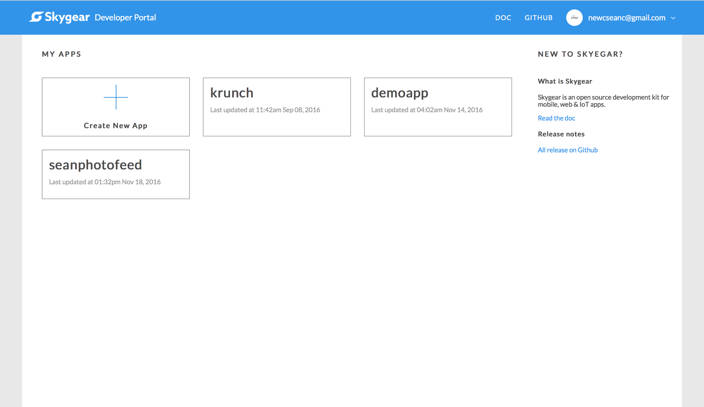
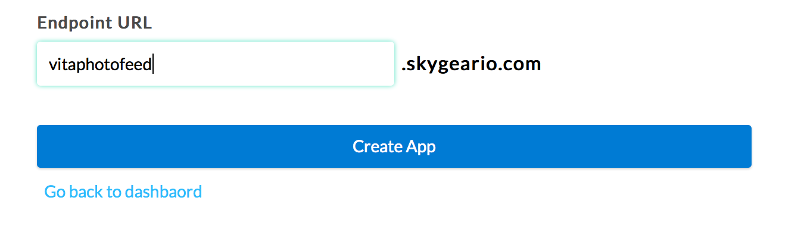
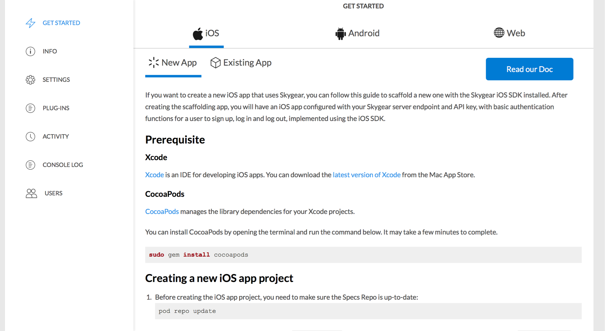
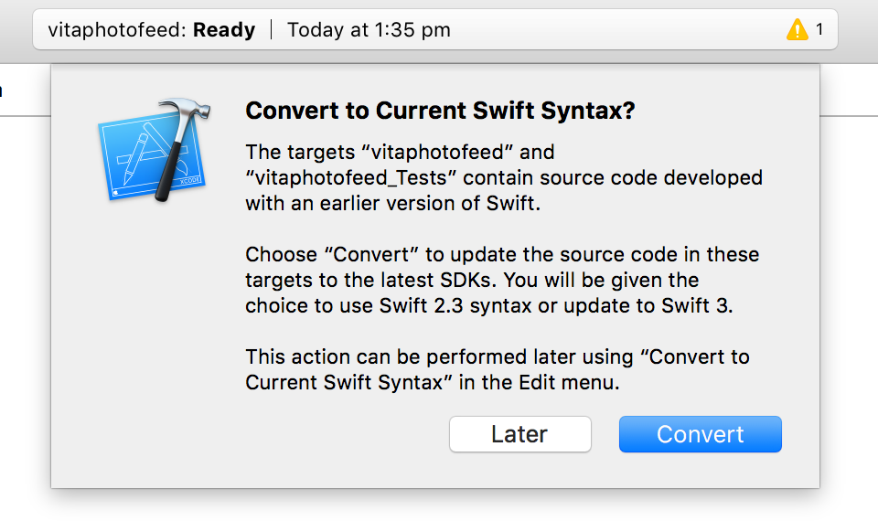

#swift-photofeed

In this tutorial, we are going to make a photo feed app, using Skygear as the backend.

Before getting started, here are the prerequisites:

- Xcode 8 or above
- Swift 3
- Cocoapods (You can refer to the [guide](https://guides.cocoapods.org/using/getting-started.html))
- A Skygear account (you can sign up [here](https://portal.skygear.io))


After signing up/logging in to the Skygear portal, you can see the screen below.




To create our photo feed app, just click on the **+ Create New App** box. You will be directed to the app creation page. Name the app **{your_name}photofeed**, in this case I will use the name "vita", so the app name is **vitaphotofeed**.




Click on **Create App** when you are done. You will be directed to the app dashboard. Follow the path *Getting Started > iOS > New App*, you will see the setup guide as shown below.





For easier setup, we will show the steps here. Since we had Cocoapods installed, we will start by scaffolding the app. Open the Terminal on your Mac, navigate to the desired folder, and run the scaffolding command:


```sh
pod lib create --silent --template-url=https://github.com/SkygearIO/skygear-Scaffolding-iOS.git "vitaphotofeed"
```

In your case, you will replace *"vitaphotofeed"* with your *"{your_name}photofeed"*.


After finishing scaffolding, we will be prompted with few questions to setup the project:

```sh
What is your name?
> <your_git_username>

What is your email?
> <your_git_email>

What is your skygear endpoint (You can find it in portal)?
Example: https://myapp.skygeario.com
> https://vitaphotofeed.skygeario.com

What is your skygear API key (You can find it in portal)?
Example: dc0903fa85924776baa77df813901efc
> <your-api-key>

What language do you want to use?? [ Swift / ObjC ]
> Swift
```

For name and email, enter the username and email your use for Git. The *skygear endpoint* and *skygear API key* information is located in the portal with the path *Info > Server Detail*. Just copy and paste the values to answer the questions. For language, type in *Swift*.  


Upon answering all the questions, scaffolding will begin. After that, Xcode will open with the project Skygear scaffolded for you. You will be prompted whether to convert the syntax to the lastest Swift. Click on **Convert**, then choose **Convert to Swift 3**, then click **Next**.



